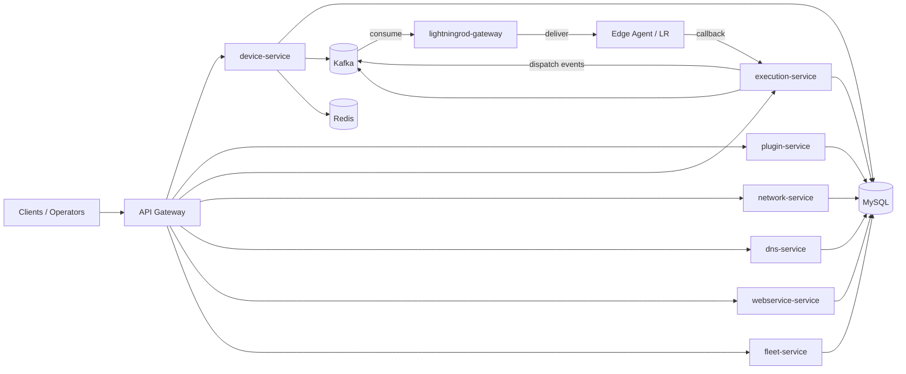
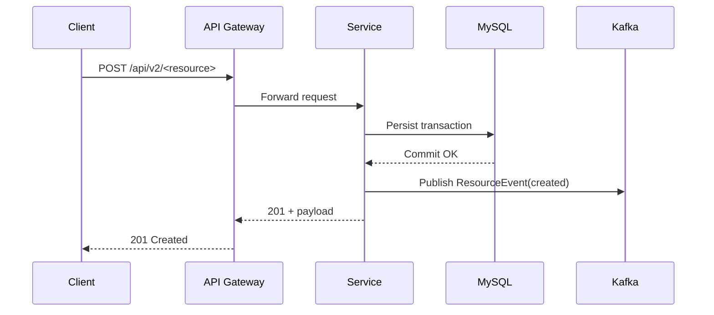
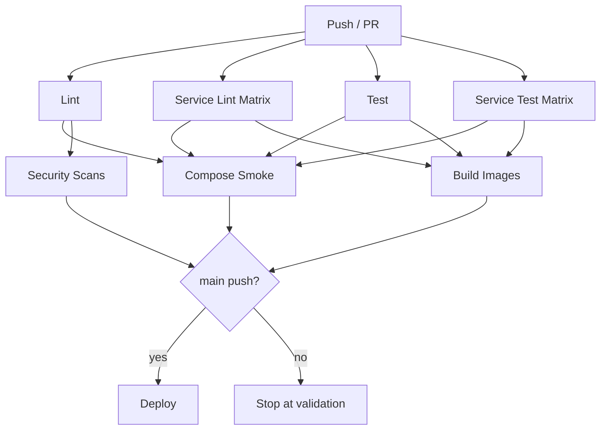

# Stack4Things v2.0

Stack4Things v2.0 is a cloud-native re-engineering of IoTronic/Stack4Things: microservice-first, Docker/Kubernetes native, event-driven, and designed to preserve OpenStack interoperability where needed.

This README is intentionally detailed to support handover and onboarding of external contributors without prior project context.

## 1) Mission and Scope

- Build a modular IoT control platform that can run independently or integrate with OpenStack ecosystems.
- Replace tightly coupled legacy patterns with service boundaries, explicit contracts, CI/CD quality gates, and operational runbooks.
- Keep an architecture that is evolvable: every major capability should be implementable as an adapter or independent service.

## 2) Current Maturity

- Version: `2.0.0-alpha`
- Runtime: `Python 3.11+`, `FastAPI`, `Docker Compose`, `Kubernetes`
- Core posture: DB-backed services, health/readiness/metrics endpoints, event contracts, CI baseline, deployment manifests.
- OpenStack posture: adapter and integration scaffolding present; full production parity with original Stack4Things still requires iterative hardening.

## 3) System Architecture

### Logical View



> **IoTronic / Lightning Rod Parity**: This architecture provides functional equivalence with the legacy IoTronic + Lightning Rod stack. The same operational concepts (board registration, heartbeat, remote command dispatch, result callback) are implemented using HTTP REST APIs and Apache Kafka instead of WAMP/Crossbar.io. See [docs/deployment/iotronic-parity-matrix.md](docs/deployment/iotronic-parity-matrix.md) for the detailed mapping.

### Runtime Topology (Local)

- `device-service` -> `http://localhost:8000` (CRUD + agent register/heartbeat)
- `plugin-service` -> `http://localhost:8001`
- `execution-service` -> `http://localhost:8002` (command pipeline: queued→dispatched→running→succeeded/failed/timeout)
- `network-service` -> `http://localhost:8003`
- `dns-service` -> `http://localhost:8004`
- `webservice-service` -> `http://localhost:8005`
- `fleet-service` -> `http://localhost:8006`
- `lightningrod-gateway` -> `http://localhost:8007` (Kafka consumer, agent sessions, delivery)
- `mysql` -> `localhost:3306`
- `redis` -> `localhost:6379`
- `kafka` -> `localhost:9092`
- `zookeeper` -> `localhost:2181`

### Request-to-Event Flow



## 4) Service Catalog

### Core Services

- `device-service`: device inventory and lifecycle primitives.
- `plugin-service`: plugin metadata lifecycle.
- `execution-service`: command/execution orchestration primitives.
- `network-service`: network port abstractions.
- `dns-service`: DNS record lifecycle.
- `webservice-service`: endpoint publication metadata.
- `fleet-service`: grouping and fleet metadata.

### Shared Libraries

- `libraries/common`: configuration, DB helpers, events, metrics, logging, auth/policy adapters, OpenStack adapters.
- `libraries/sdk`: client-side SDK primitives (REST + evolving gRPC support).

### Platform Assets

- `infrastructure/kubernetes`: deployment manifests, monitoring, policy, gateway, mesh, secrets, progressive rollout assets.
- `scripts`: setup/testing/operations automation.
- `.github/workflows`: CI/CD and governance pipelines.

## 5) API Contract Baseline

All core services expose:

- `GET /health`
- `GET /ready`
- `GET /metrics`

CRUD baseline endpoints:

- `plugin-service`: `POST/GET/DELETE /api/v2/plugins`
- `execution-service`: `POST/GET/DELETE /api/v2/executions`
- `network-service`: `POST/GET/DELETE /api/v2/ports`
- `dns-service`: `POST/GET/DELETE /api/v2/dns/records`
- `webservice-service`: `POST/GET/DELETE /api/v2/webservices`
- `fleet-service`: `POST/GET/DELETE /api/v2/fleets`

## 6) Data, Events, and Reliability

### Persistence

- Core services run MySQL-backed in Docker/K8s environments.
- Local fallback paths may use SQLite for fast testing.

### Eventing

- Shared event contract in `libraries/common/src/common/events/contracts.py`.
- Contract includes `event_type`, `service`, `resource`, `action`, `resource_id`, `payload`, `occurred_at`.
- Publish retry and structured logging are present on core publishers.

### Reliability Building Blocks

- Idempotency, outbox, and DLQ primitives exist in `libraries/common/src/common/events`.
- Replay tooling exists in `scripts/event-replay.py`.
- Runtime hardening should continue by wiring these primitives into all write/event paths.

## 7) Auth, Policy, and OpenStack Interop

### Current Auth Baseline

- Bearer middleware in core services.
- Dev token fallback is available for local workflows.
- JWT payload checks and write-role guardrail implemented.

### Shared Auth/Policy Modules

- `libraries/common/src/common/auth/oidc.py`
- `libraries/common/src/common/auth/policy_engine.py`

### OpenStack Adapter Layer

- `libraries/common/src/common/openstack/keystone_adapter.py`
- `libraries/common/src/common/openstack/neutron_adapter.py`
- `libraries/common/src/common/openstack/nova_adapter.py`
- `libraries/common/src/common/openstack/glance_cinder_adapter.py`

These adapters provide interoperability hooks while preserving service modularity.

## 8) Local Development Guide

### Prerequisites

- Docker + Docker Compose
- Python 3.11+
- Optional: Poetry, `hey`, kubectl

### Start Stack

```bash
docker compose -f docker-compose.dev.yml up -d --build
```

### Smoke Check

```bash
curl -fsS http://localhost:8000/health
curl -fsS http://localhost:8001/health
curl -fsS http://localhost:8002/health
curl -fsS http://localhost:8003/health
curl -fsS http://localhost:8004/health
curl -fsS http://localhost:8005/health
curl -fsS http://localhost:8006/health
```

### Stop/Clean

```bash
docker compose -f docker-compose.dev.yml down -v
```

## 9) Validation and Test Entry Points

### Primary Validation Scripts

- Full local baseline: `scripts/test-all.sh`
- Cross-service flow: `scripts/integration-cross-service.sh`
- API contract checks: `scripts/contract-tests-api.py`
- Post-alpha suite: `scripts/postalpha-validation.sh`
- Chaos drill: `scripts/chaos-drill.sh`
- Backup/restore validation: `scripts/backup-restore-validate.sh`
- Performance baseline: `scripts/perf-baseline.sh`
- Load catalog: `scripts/load-profile-catalog.sh`
- DR game day: `scripts/dr-gameday.sh`

### Recommended Validation Sequence (Local)

1. `docker compose -f docker-compose.dev.yml up -d --build`
2. `bash scripts/test-all.sh`
3. `bash scripts/postalpha-validation.sh`
4. targeted script(s) for the component you changed

## 10) CI/CD and Governance Workflows

### Main Pipeline

- `.github/workflows/ci.yml`: lint, test, compose smoke, security scans, build, deploy path.



### Extended Governance/Operations Pipelines

- OpenAPI governance: `.github/workflows/openapi-contract.yml`
- DB schema contracts: `.github/workflows/db-schema-contract.yml`
- Kafka schema compatibility: `.github/workflows/kafka-schema-compatibility.yml`
- SBOM/provenance: `.github/workflows/sbom-supply-chain.yml`
- Synthetic monitoring: `.github/workflows/synthetic-monitoring.yml`
- Promotion: `.github/workflows/promotion.yml`
- SDK stability: `.github/workflows/sdk-stability.yml`
- Release cadence gate: `.github/workflows/release-train.yml`
- Post-alpha scheduled suite: `.github/workflows/postalpha-validation.yml`

## 11) Kubernetes/Platform Assets

### Key Areas

- Gateway routing/rate limits: `infrastructure/kubernetes/kong`
- Monitoring/alerts/SLO rules: `infrastructure/kubernetes/monitoring`
- Mesh mTLS baseline: `infrastructure/kubernetes/mesh/istio-mtls.yaml`
- External secrets baseline: `infrastructure/kubernetes/secrets/external-secrets.yaml`
- Policy enforcement baseline: `infrastructure/kubernetes/policies/kyverno-security.yaml`
- Progressive delivery baseline: `infrastructure/kubernetes/progressive-delivery/rollout-device.yaml`
- Schema registry baseline: `infrastructure/kubernetes/kafka/schema-registry.yaml`

### Important Note

Some assets are intentionally baseline-level. They provide a concrete start, but each target environment should enforce stricter secrets, identities, network policies, and rollout criteria.

## 12) Troubleshooting Cheat Sheet

### Service Not Ready

1. Check `/health` then `/ready`.
2. Check MySQL/Kafka/Redis readiness.
3. Verify service logs with `x-trace-id` or `x-correlation-id`.

### Event Publish Missing

1. Verify Kafka connectivity and topic prefix env vars.
2. Confirm producer startup logs.
3. Inspect retry logs for publish failures.

### Migration Failures

1. Check `alembic current` and `alembic history`.
2. Validate DB URL and credentials.
3. Roll back controlled revision if needed, then re-run.

### CI Failures

1. Identify failing workflow category (lint, test, schema, security, deploy).
2. Run equivalent local script.
3. Reproduce with same env vars/profile.

## 13) Operational Runbooks (Condensed)

### Incident Response

1. Triage impact by service and endpoint.
2. Validate dependencies first (DB/Kafka/Redis).
3. Isolate faulty change.
4. Restart/rollback narrowly.
5. Re-run smoke + integration + contract checks.

### Rollback

1. Select prior stable artifact.
2. Apply rollback via deployment channel.
3. Verify write/read paths and event pipeline.
4. Close only after post-rollback checks pass.

### DB Migration Failure

1. Freeze writes.
2. Inspect revision mismatch.
3. Controlled downgrade or restore path.
4. Re-test in staging before production retry.

## 14) Handover Guide for New Contributors

If you are picking up development from this repository:

1. Read sections 3, 8, 9, and 10 first.
2. Start stack locally and run `scripts/test-all.sh`.
3. Choose one service and trace its full path (API -> DB -> event publish).
4. When adding features:
   - update API contract and tests,
   - preserve observability headers/metrics,
   - keep changes backward-compatible where possible,
   - wire any new dependency into compose and CI.
5. Before pushing:
   - run local validation scripts relevant to your change,
   - ensure workflow parity (what you ran locally maps to CI jobs).

## 15) Roadmap Reality and Gaps

This repository contains both production-facing implementations and baseline/scaffolding assets.  
When planning next iterations, classify each item as:

- `runtime-wired`: actively used by services in production path
- `platform-baseline`: deployable infra primitive not fully wired end-to-end
- `governance-baseline`: policy/process/workflow ready, needing environment secrets and rollout hardening

This classification prevents “false done” and helps prioritize what still needs runtime closure.

## 16) Security Notes

- Never commit secrets in repository files.
- Prefer secret stores and runtime injection.
- Keep dependencies and images patched.
- Treat CI security scans as release gates.

## 17) License

Apache License 2.0

