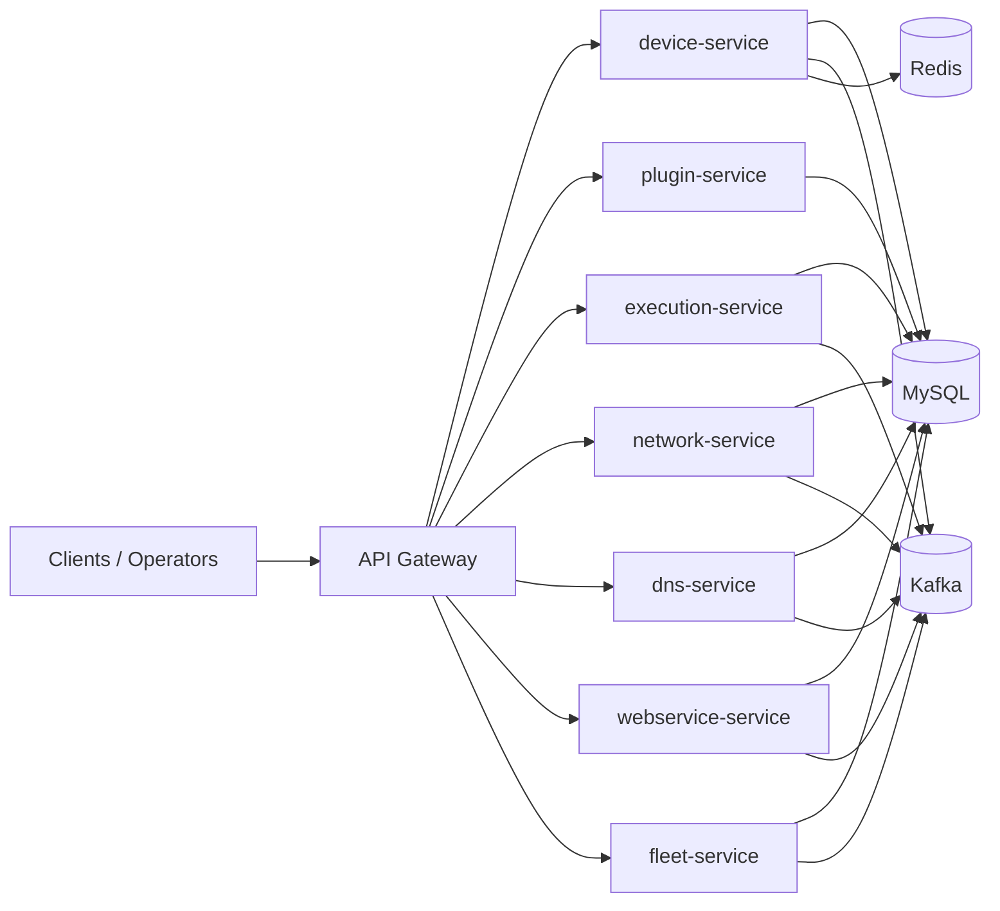
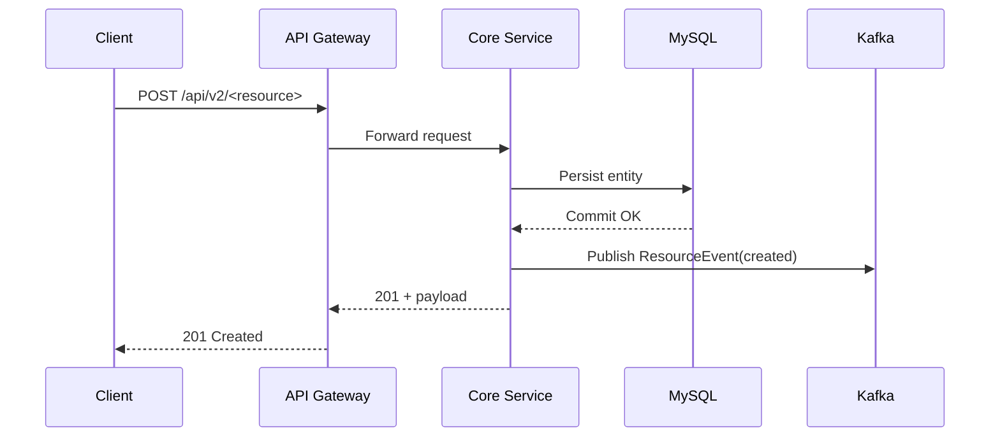
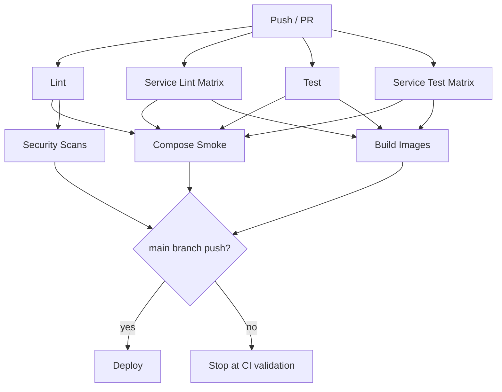
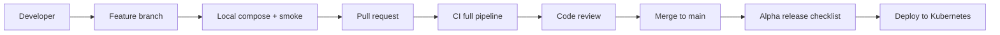

# Stack4Things v2.0

Cloud-native IoT platform re-engineering of IoTronic/Stack4Things, based on Docker microservices, with progressive OpenStack compatibility.

## Project Status

- Version: `2.0.0-alpha`
- Development stage: active
- Runtime baseline: Python 3.11+, FastAPI, Docker Compose, Kubernetes
- Current implementation focus: microservices stabilization, DB persistence, auth baseline, CI hardening

## Current Architecture

- Core services:
  - `device-service`
  - `plugin-service`
  - `execution-service`
  - `network-service`
  - `dns-service`
  - `webservice-service`
  - `fleet-service`
- Shared libraries:
  - `libraries/common` for shared utilities
  - `libraries/sdk` for client-facing SDK work
- Infrastructure:
  - `docker-compose.dev.yml` for local orchestration
  - Kubernetes manifests under `infrastructure/kubernetes`



## Docker Runtime Map

- `device-service` -> `http://localhost:8000`
- `plugin-service` -> `http://localhost:8001`
- `execution-service` -> `http://localhost:8002`
- `network-service` -> `http://localhost:8003`
- `dns-service` -> `http://localhost:8004`
- `webservice-service` -> `http://localhost:8005`
- `fleet-service` -> `http://localhost:8006`

Supporting services:

- MySQL 8 (`localhost:3306`)
- Redis 7 (`localhost:6379`)
- Kafka + Zookeeper (`localhost:9092`, `localhost:2181`)

## API Baseline

All core services expose:

- `GET /health`
- `GET /ready`
- `GET /metrics`

CRUD baseline endpoints:

- Plugin: `POST/GET/DELETE /api/v2/plugins`
- Execution: `POST/GET/DELETE /api/v2/executions`
- Network: `POST/GET/DELETE /api/v2/ports`
- DNS: `POST/GET/DELETE /api/v2/dns/records`
- Webservice: `POST/GET/DELETE /api/v2/webservices`
- Fleet: `POST/GET/DELETE /api/v2/fleets`

Persistence status:

- `device-service`: MySQL-backed
- `plugin-service`: DB-backed (MySQL in Docker, SQLite fallback local)
- `execution-service`: DB-backed (MySQL in Docker, SQLite fallback local)
- `network-service`: DB-backed (MySQL in Docker, SQLite fallback local)
- `dns-service`: DB-backed (MySQL in Docker, SQLite fallback local)
- `webservice-service`: DB-backed (MySQL in Docker, SQLite fallback local)
- `fleet-service`: DB-backed (MySQL in Docker, SQLite fallback local)

## Auth and Access Baseline

Implemented on core services:

- Bearer token middleware (toggle via `AUTH_ENABLED`)
- Development token support (`AUTH_DEV_TOKEN`)
- JWT payload checks (`exp`, optional `iss` via `KEYCLOAK_ISSUER`)
- Role gate for write operations (`AUTH_WRITE_ROLE`, default `writer`)

Note: this is a baseline guardrail; full Keycloak validation, policy engine integration, and fine-grained RBAC are planned next.

## Events Baseline

Shared event contracts are defined in:

- `libraries/common/src/common/events/contracts.py`

Current contract model:

- `ResourceEvent` with fields for source service, resource, action (`created|updated|deleted`), resource id, payload, timestamp



## Shared Platform Utilities

Database helpers:

- Async/sync helpers in `libraries/common/src/common/database/database.py`
- Service sync DB helpers in `libraries/common/src/common/database/service_db.py`

Event bus helpers:

- `libraries/common/src/common/events/event_bus.py`

## Local Development

Prerequisites:

- Docker + Docker Compose
- Python 3.11+

Run full stack:

```bash
docker compose -f docker-compose.dev.yml up -d --build
```

Quick smoke:

```bash
curl http://localhost:8000/health
curl http://localhost:8001/health
curl http://localhost:8002/health
curl http://localhost:8003/health
curl http://localhost:8004/health
curl http://localhost:8005/health
curl http://localhost:8006/health
```

Stop and clean:

```bash
docker compose -f docker-compose.dev.yml down -v
```

## CI/CD

Main workflow:

- Lint (`black`, `ruff`, `mypy`, pre-commit)
- Test
- Docker compose smoke
- Build
- Security scans
- Deploy (main branch)

Workflow file: `.github/workflows/ci.yml`



## Delivery Workflows



## Contributing

Recommended baseline workflow:

1. Create a feature branch
2. Implement incremental, testable changes
3. Run local compose smoke before PR
4. Keep commits coherent and reviewable
5. Open PR with clear summary and test notes

## Security Notes

- Never commit secrets in repository files
- Prefer env variables / secret managers
- Keep dependency updates frequent
- Use CI security scans as mandatory quality signal

## License

Apache License 2.0

## Operational Runbooks

### Incident Response

1. Identify impacted services with `/health`, `/ready`, `/metrics`.
2. Verify dependencies in order: MySQL, Kafka, Redis, then core services.
3. Inspect recent logs filtered by `x-correlation-id` and `x-trace-id`.
4. Isolate failing component and execute targeted restart.
5. Validate recovery with cross-service integration and contract tests.

### Rollback Procedure

1. Select previous stable image tag for impacted service.
2. Roll back deployment in Kubernetes or compose tag override.
3. Validate read/write endpoints and event publish after rollback.
4. Re-run smoke and contract suites before closing incident.

### Service Restart

- Docker: `docker compose -f docker-compose.dev.yml restart <service>`
- Kubernetes: `kubectl rollout restart deployment/<service> -n stack4things`
- Always validate `/ready` before reopening traffic.

### DB Migration Failure

1. Stop write traffic to the impacted service.
2. Check Alembic history and current revision.
3. If partial migration: apply controlled downgrade to previous revision.
4. Restore from latest snapshot if data integrity is at risk.
5. Re-run migration in staging, then production with maintenance window.

## Alpha Release Go/No-Go Checklist

- [ ] All core services healthy in Docker and Kubernetes.
- [ ] Cross-service flow (`device -> network -> dns -> webservice`) passes.
- [ ] API contract tests pass for all `/api/v2` endpoints.
- [ ] Security gates (Bandit, Safety, Snyk, Trivy) pass with high-severity blocking.
- [ ] CI lint and tests pass (monorepo + service matrix).
- [ ] Kafka event publishing validated with retry and traceability.
- [ ] Alembic migrations validated on clean and existing databases.
- [ ] Resource limits/probes/HPA applied to core deployments.
- [ ] Runbook drills completed (incident, rollback, restart, migration failure).
- [ ] Release notes and deployment approval signed off.

## Post-Alpha Implementation Assets

- OIDC/policy engine baseline in `libraries/common/src/common/auth`.
- Idempotency/outbox/DLQ primitives in `libraries/common/src/common/events`.
- OpenAPI contract governance workflow in `.github/workflows/openapi-contract.yml`.
- SBOM + provenance workflow in `.github/workflows/sbom-supply-chain.yml`.
- Environment promotion workflow in `.github/workflows/promotion.yml`.
- SLO alert rules in `infrastructure/kubernetes/monitoring/prometheus/slo-rules.yaml`.
- Gateway rate-limit policy in `infrastructure/kubernetes/kong/kong-rate-limit.yaml`.
- Chaos, backup/restore and performance scripts in `scripts/chaos-drill.sh`, `scripts/backup-restore-validate.sh`, `scripts/perf-baseline.sh`.
- End-to-end post-alpha validation runner in `scripts/postalpha-validation.sh`.
- Scheduled/manual CI suite in `.github/workflows/postalpha-validation.yml`.

### Run Full Post-Alpha Suite Locally

```bash
bash scripts/postalpha-validation.sh
```

## Next-Horizon Assets

- Service mesh mTLS baseline: `infrastructure/kubernetes/mesh/istio-mtls.yaml`
- External Secrets baseline: `infrastructure/kubernetes/secrets/external-secrets.yaml`
- DB schema contracts in CI: `.github/workflows/db-schema-contract.yml`
- Kafka schema compatibility in CI: `.github/workflows/kafka-schema-compatibility.yml`
- Event replay tooling: `scripts/event-replay.py`
- Tenancy/versioning/audit shared modules: `libraries/common/src/common/tenancy.py`, `libraries/common/src/common/api_versioning.py`, `libraries/common/src/common/audit.py`
- Synthetic monitoring: `.github/workflows/synthetic-monitoring.yml`
- Error budget and FinOps policies: `docs/error-budget-policy.yaml`, `docs/finops-cost-model.yaml`
- DR, load catalog and migration strategy: `scripts/dr-gameday.sh`, `scripts/load-profile-catalog.sh`, `docs/zero-downtime-migrations.yaml`
- Progressive delivery and policy enforcement: `infrastructure/kubernetes/progressive-delivery/rollout-device.yaml`, `infrastructure/kubernetes/policies/kyverno-security.yaml`
- SDK stability and release train: `.github/workflows/sdk-stability.yml`, `.github/workflows/release-train.yml`, `libraries/sdk/CHANGELOG.json`

